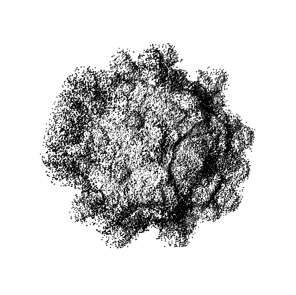
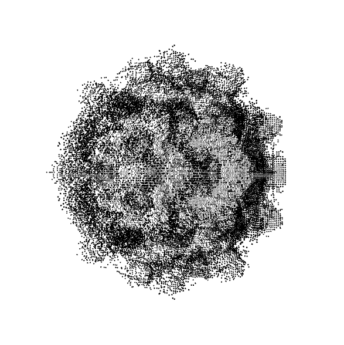
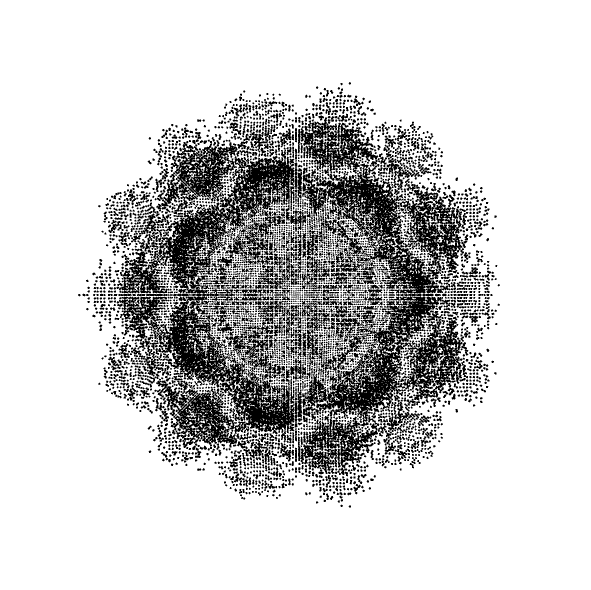

## An openFrameworks C++ port of the Coding Train's Mandelbulb in Processing (Java)

#### Here are some screenshots of the Mandelbulb (point cloud). 

You can mouse-drag to view the 3D point cloud from different
angles. You can also use the mouse wheel to zoom in/out.

#### Relevant references: 

- https://www.youtube.com/watch?v=NJCiUVGiNyA
- https://www.skytopia.com/project/fractal/mandelbulb.html
- https://www.skytopia.com/project/fractal/2mandelbulb.html
